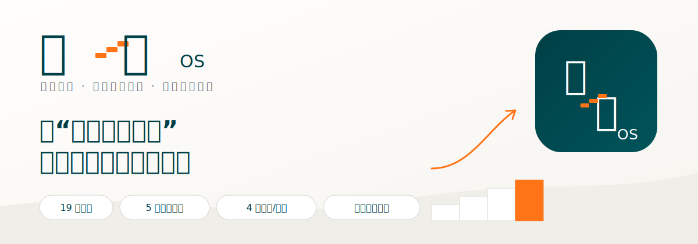

<p align="center">
  
</p>

<p align="center">
  <a href="https://a-do.top"><strong>官方网站</strong></a> ·
  <a href="#三个可安装的-skill"><strong>体验产品</strong></a> ·
  <a href="SERVICES.md"><strong>专业服务</strong></a> ·
  <a href="https://github.com/githubume/chengxing-os-skills/releases"><strong>版本发布</strong></a>
</p>

# 成行 OS Skills

把“知道却做不到”转成可观察、可执行、可恢复的行为实验。

成行 OS 是成长行为学与场景行为工程的数字系统。本仓库把长期方法积累做成三个可安装的 AI Skill，支持 Claude Code 和 Codex：不是继续劝人自律，而是帮助用户找到行为发生的真实条件，设计一个足够小的行动，并在第 3、7 天根据结果继续调整。

```text
模糊困扰 → 可观察行为 → 竞争假设 → 最小实验 → 跟踪变化 → 失败恢复
```

## 为什么值得信任

可信性不来自一句“专家背书”，而来自四层可以检查的基础：

1. **17 年一线实践**：发起人阿do长期参与大型工程、核电安全与行为风险管理，持续使用行为观察、风险分层、纠偏和复盘闭环解决真实执行问题。
2. **真实家庭场景**：长期家庭教育实践，以及对 K–12 作业、手机、情绪与亲子互动场景的持续研究，让方法必须接受真实生活检验。
3. **跨学科方法**：把行为科学、儿童发展、学习科学、系统工程和 AI 产品化整合为“场景—行为—结果—反馈”的可执行流程。
4. **公开可验证产品**：方法不是停留在文章和课程中，而是被编码为可安装 Skill、质量门禁、本地数据结构和虚构示例。

我们不虚构专家、机构合作或效果证明。外部理论和专家观点只作为公开知识来源，不代表其认可或背书成行 OS。更多背景见 [关于成行 OS](ABOUT.md)。

## 三个可安装的 Skill

| 产品 | 典型问题 | 用户得到什么 |
|---|---|---|
| [`habit-rebuild`](plugins/habit-rebuild) | 拖延、睡前手机、晚睡流程、运动启动、反复复发 | 行为评估、七天最小实验、跟踪指标和复发恢复脚本 |
| [`parent-learning`](plugins/parent-learning) | 作业启动、反复催促、手机边界、亲子学习冲突 | 孩子、家长和环境共同参与的家庭行为实验 |
| [`conflict-reset`](plugins/conflict-reset) | 重复争吵、暂停、边界、修复、事后反刍 | 冲突循环、暂停/边界脚本和可跟踪的复位行动 |

三个产品共享同一套价值原则：

- 不给人贴标签，先把问题改写为可观察行为；
- 不一次改变所有变量，只验证一个关键假设；
- 不把漏做视为归零，每个计划都有恢复脚本；
- 不把 AI 当诊断者，高风险问题立即停止普通路径。

## 产品价值

普通 AI 往往给出一串“应该做什么”。成行 OS 更关注四个结果：

- **看得清**：区分事实、解释、未知信息和竞争假设；
- **做得动**：把第一步缩小到困难状态下仍可能完成；
- **能验证**：指标不超过三个，并设置第 3、7 天复盘；
- **可持续**：把中断、复发和冲突后的恢复写进方案本身。

每个 Skill 都先执行 B1/B2/B3 路由：B1 处理单一低风险行为；B2 处理多变量和反复失败；B3 面对自伤、暴力、胁迫、跟踪、武器或儿童危险时停止普通计划，优先安全与当地专业支持。

## 60 秒安装

### Claude Code

```bash
claude plugin marketplace add githubume/chengxing-os-skills
claude plugin install habit-rebuild@chengxing-os-skills
claude plugin install parent-learning@chengxing-os-skills
claude plugin install conflict-reset@chengxing-os-skills
```

重新启动 Claude Code，直接用自然语言提问。

### Codex

```bash
git clone https://github.com/githubume/chengxing-os-skills.git
python3 chengxing-os-skills/scripts/manage_codex_adapters.py install
```

安装后新建一个 Codex 任务。升级或卸载：

```bash
git -C chengxing-os-skills pull
python3 chengxing-os-skills/scripts/manage_codex_adapters.py upgrade
python3 chengxing-os-skills/scripts/manage_codex_adapters.py uninstall
```

卸载不会删除 `~/.chengxing-os` 中的画像或案例；是否删除由用户决定。

## 第一次使用

无需记忆命令，直接说：

- “我睡前总刷手机到很晚，帮我设计一个七天最小实验。”
- “孩子写作业要催五次，帮我分析孩子、家长和环境的循环。”
- “我们一谈家务就互相指责，帮我找出最早升级点。”

完整虚构示例： [睡前刷手机](examples/habit-rebuild-bedtime-phone.md) · [作业启动与催促](examples/parent-learning-homework-start.md) · [家务冲突与修复](examples/conflict-reset-housework.md)

## 品牌与专业服务

| 层级 | 角色 |
|---|---|
| **成长行为学实验室** | 连接研究、内容、案例与实践核定 |
| **成行 OS** | 把方法转化为测评、训练、反馈和数据闭环 |
| **成行 OS Skills** | 任何人都能安装和验证的公开产品入口 |
| **专业服务** | 为个人、家庭、学校、机构和团队提供人工梳理、工作坊、定制与本地部署 |

可提供 B2 复杂行为系统梳理、机构 Skill/知识库定制、成长行为工作坊和 Claude Code/Codex 本地部署。查看 [专业服务说明](SERVICES.md)，或通过 [官方网站](https://a-do.top/join) 和 [服务咨询 Issue](https://github.com/githubume/chengxing-os-skills/issues/new?template=service-inquiry.yml) 联系。

请勿在公开 Issue 中填写姓名、儿童资料、健康记录、真实聊天或危机细节。

## 隐私、安全与开源

- 默认不保存；任何写入、导出或删除必须先预览并明确确认。
- 数据只保存在本机 `~/.chengxing-os`，没有遥测、自动上传或自动消息。
- 本仓库只使用虚构示例，不含真实用户案例。
- 项目提供教育性和行为设计支持，不替代医疗、心理治疗、危机干预或其他持证专业服务。

详见 [安全边界](SAFETY.md)、[隐私说明](PRIVACY.md) 和 [Apache-2.0 许可证](LICENSE)。成行 OS 名称与视觉标识不随开源许可证授权。

---

<p align="center"><strong>成长不是知道更多，而是高价值行为持续成行。</strong></p>
